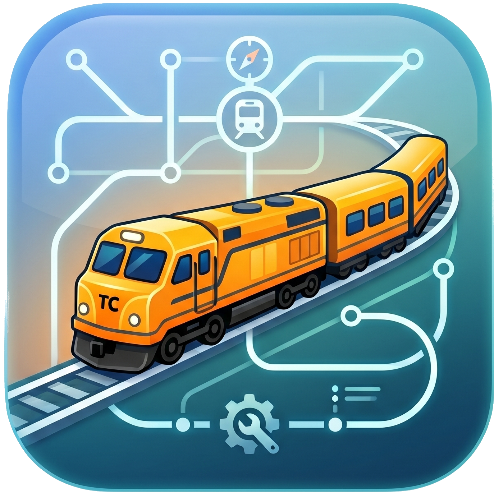
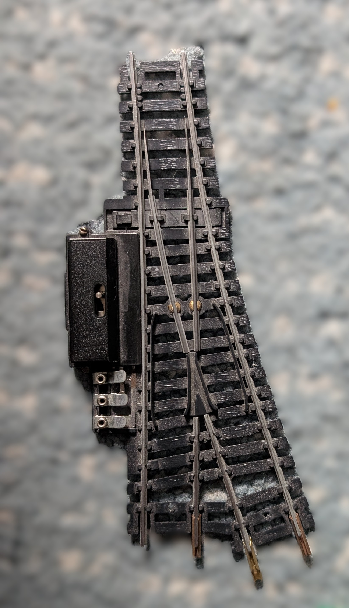
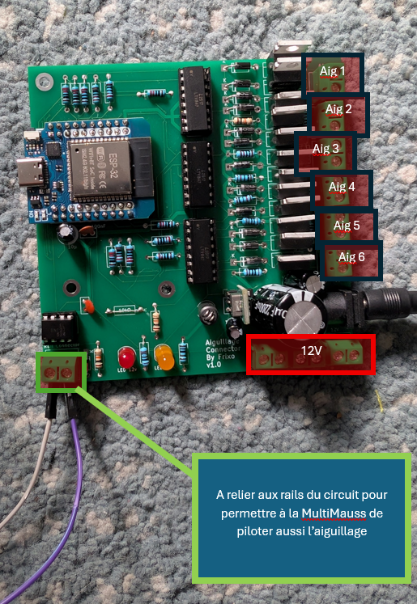
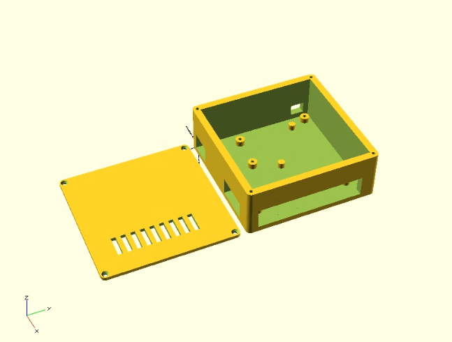

# 🚂 AiguillageManager — Pilotez en DCC vos aiguillages à solénoïde

<p align="center">
  
</p>

Le but de ce projet est de numériser et de rendre compatibles DCC les aiguillages à bobines traditionnels (les modèles analogiques classiques que l'on trouve d'occasion pour quelques euros).

<p align="center">
  
  <br><em>Aiguillage à bobine standard — le genre d'aiguillage que ce projet permet de piloter en Wi-Fi et en DCC.</em>
</p>

Grâce à ce boîtier, vous pouvez piloter vos aiguillages de deux manières :

- **En Wi-Fi :** Via une ou plusieurs tablettes tactiles synchronisées en temps réel, qui affichent le tracé de votre réseau avec des boutons interactifs.
- **En DCC :** Directement depuis votre télécommande MultiMAUS branchée sur votre centrale ferroviaire.

---

## ✨ Fonctionnalités

### Interface Web (TCO tactile)
- Design glassmorphism, fond de plan personnalisable
- Mode Utilisateur / Mode Configuration
- Drag & drop des switchs, masquage, redimensionnement
- Zoom ×2 à ×10, zoom libre
- Panneau **Historique** des actions
- Panneau **DCC log** : toutes les commandes DCC reçues, avec filtre "aiguillages uniquement"
- **Gyrophare rouge** et sirène 3s quand le signal DCC est perdu
- Badge DCC OK / KO / Arrêt Urgence 🚨
- Bouton **Muette** 🔊/🔇 l'alerte sonore
- Clic sur "DCC OK" → historique DCC ; clic sur 📜 → historique actions

### DCC
- Détection et décodage des adresses d'aiguillage (formule universelle `((addr-33016)/256)*4 + ((addr-33016)%256)/2 + 1`)
- Mapping configurable : chaque switch peut répondre à n'importe quelle adresse DCC (1-99)
- Ordres d'ouverture / fermeture avec sons distincts (notes ascendantes/descendantes)
- Arrêt d'urgence (overlay rouge + badge clignotant + son)
- `logdcc(true/false)` — log brut en console
- `logPin(true/false)` — monitoring de la pin DCC

### WiFi
- Connexion non-bloquante (le serveur démarre sans attendre le WiFi)
- Reconnexion automatique
- LED interne clignote si WiFi perdu
- OTA (mise à jour firmware et filesystem par WiFi)
- Heartbeat toutes les 5s avec timeout 15s (détection de perte de connexion)

### Console navigateur
| Commande | Description |
|----------|-------------|
| `help()` | Affiche l'aide |
| `logdcc(true/false)` | Log DCC brut dans la console |
| `logPin(true/false)` | Active la surveillance pin DCC |
| `cancel_detect_dcc_off(true/false)` | Ignore la perte de signal DCC |

---

## 🛠️ Hardware

Pour matérialiser ce projet, il est nécessaire de fabriquer une carte électronique sur mesure qui sert d'interface de puissance et de sécurité. Vous trouverez dans ce projet un dossier nommé `gerber.zip` contenant tous les fichiers de fabrication industriels.

Pour la commande du PCB, vous pouvez passer par **JLCPCB** (aucun lien ni affiliation). En dehors du délai de livraison proche d'un mois, c'est vraiment le moins cher. Il vous suffit de téléverser le fichier `gerber.zip` sur leur site pour commander et faire imprimer le circuit imprimé professionnel pour moins de 10 €.

Pour les pièces détachées (composants électroniques), je conseille **AliExpress** (aucun lien ni affiliation).

Une fois la carte et les composants reçus, il faudra souder le tout vous-même.

<p align="center">
  
  <br><em>Carte électronique du projet — interface de puissance et de sécurité pour 6 aiguillages.</em>
</p>

<p align="center">
  
  <br><em>Carte et aiguillage annotés — repérage des principaux composants et connexions.</em>
  <br><em>⚠️ Sur la photo, on voit qu'une résistance de 10 kΩ a été shuntée. Il s'agit d'une erreur de conception de la V1.0, corrigée dans la <strong>V1.1</strong> (présente dans ce projet). Dans la V1.1, cette résistance est correctement soudée sur le circuit imprimé. Dans la V1.0, la résistance est également présente mais a dû être soudée manuellement à l'arrière de la carte de façon peu propre.</em>
</p>

<p align="center">
  
  <br><em>Boîtier d'impression 3D — pour protéger la carte électronique et la connectique.</em>
</p>

Un fichier **STL** est inclus dans ce projet pour imprimer un boîtier de protection adapté aux dimensions exactes du PCB. Il est recommandé d'imprimer ce boîtier en **PETG** (éviter l'ABS, car la carte peut chauffer un peu). Le fichier STL doit être transformé en GCode comme d'habitude — je conseille le logiciel **CURA** (aucun lien ni affiliation).

En entrée, cette carte doit être alimentée par un **bloc d'alimentation 12V - 2A** (référence exacte : alimentation à découpage 12V 2A avec connecteur Jack DC 5.5 × 2.1 mm). Une fois cette alimentation branchée sur le connecteur Jack de la carte, il n'est plus du tout nécessaire d'alimenter l'ESP32 en USB-C, car le circuit s'occupe de réguler et de distribuer l'énergie nécessaire au microcontrôleur.

En sortie, cette carte électronique fournit de quoi alimenter **jusqu'à 6 aiguillages standards en 12V**, et permet de contrôler individuellement le basculement dans les deux sens (voie directe ou voie déviée) pour chacun de ces 6 aiguillages.

Pour cela, le circuit intègre une **triple sécurité** indispensable :
- L'**optocoupleur rapide 6N137** isole et protège l'ESP32 des tensions élevées et des parasites de la voie DCC.
- Des **optocoupleurs PC817** isolent totalement la partie commande basse tension (3,3V) de la partie puissance (12V) des aiguillages.
- Des **transistors MOSFET** font office d'interrupteurs "gros bras" pour encaisser et envoyer le fort ampérage (plusieurs Ampères) réclamé par les bobines analogiques sans surcharger le microcontrôleur.

### Liste des composants

| Composant | Description / Rôle | Qté |
|---|---|---|
| Module WiFi D1 MINI ESP32 | Microcontrôleur (cerveau du projet, version 30 ou 38 broches selon votre PCB) | 1 |
| Optocoupleur 6N137 | Isolation haute vitesse pour la lecture du signal DCC des rails | 1 |
| Support DIP-8 | Support pour accueillir l'optocoupleur 6N137 sans avoir à le souder directement | 1 |
| Optocoupleurs PC817 | Isolation des signaux de commande des aiguillages (sécurité CPU) | 12 |
| Supports DIP-4 | Supports pour accueillir les 12 optocoupleurs PC817 | 12 |
| Transistors MOSFET | Interrupteurs de puissance pour envoyer les Ampères aux bobines | 12 |
| Diodes 1N4148 | Diode de commutation rapide pour le circuit d'entrée DCC | 1 |
| Diodes 1N4007 | Diodes de roue libre pour protéger le circuit des retours de force des bobines | 12 |
| Résistance 1 kΩ | Protection de la LED interne de l'optocoupleur 6N137 | 1 |
| Résistance 10 kΩ | Résistance de Pull-Up pour la ligne de signal DCC (broche 6) | 1 |
| Résistances (220 Ω à 1 kΩ) | Résistances de commande pour les lignes des transistors | 12 |
| Condensateur 100 nF | Condensateur de découplage pour stabiliser l'alimentation du 6N137 | 1 |
| Borniers à vis 5.08 mm | Connecteurs pour l'arrivée des rails et les sorties vers les aiguillages | Selon design |
| Inducteur de perle de ferrite (6 canaux) | Filtre antiparasite multi-lignes pour bloquer les bruits électromagnétiques | 1 |
| Prise Jack DC femelle | Connecteur d'alimentation pour recevoir le bloc 12V (5.5 × 2.1 mm) | 1 |

> ⚠️ **Conseil important :** Prenez le temps de bien souder chaque composant, dans le bon sens. Un défaut de soudure (point sec, court-circuit, composant inversé) peut rendre la carte inopérante, voire endommager définitivement l'ESP32 ou les composants connectés. Une inspection visuelle à la lampe et un passage au multimètre avant la mise sous tension sont vivement recommandés.

### Détails de conception

- ESP32 Wemos D1 mini32
- Optocoupleur 6N137 pour isolation DCC
- 12 MOSFETs pour piloter 6 aiguillages double-bobine
- Protection anti-surchauffe (impulsions 500ms)
- Synchronisation physique au démarrage (impulsions espacées 600ms)

---

## 🔐 Fichier `secrets.h` (obligatoire)

Avant de compiler, crée le fichier `src/secrets.h` avec tes identifiants WiFi :

```cpp
#ifndef SECRETS_H
#define SECRETS_H

#define WIFI_SSID "ton_ssid"
#define WIFI_PASSWORD "ton_mot_de_passe"

#endif
```

Ce fichier est dans `.gitignore` → pas de risque de l'uploader sur GitHub.

---

## 📦 Upload & Flash

### Première fois (filaire USB)
```bash
pio run -t upload           # Flash firmware
pio run --target uploadfs   # Upload filesystem (HTML/CSS/JS/images)
```

### OTA (mise à jour WiFi)
```bash
pio run -t upload --upload-port AiguillageManager.local
pio run --target uploadfs --upload-port AiguillageManager.local
```

---

## 🔧 Configuration

### Attribution d'adresse DCC
1. Passer en **Mode Configuration**
2. Cliquer droit sur un switch → "Attribuer une adresse d'aiguillage"
3. Saisir un numéro (1-99)
4. Le numéro s'affiche sur le switch

### Plan de fond
1. Mode Configuration → "Plan" → Upload/Photo
2. L'image est redimensionnée à 1920px max et stockée sur l'ESP

---

## 🔄 Historique des versions

- **v1.15+** : Mapping DCC configurable, panneau DCC log, gyrophare, sirène, OTA, heartbeat, badges DCC OK/KO/Urgence

---

## ⚖️ Avertissement légal

Ce projet est fourni à titre éducatif et récréatif. La fabrication, le câblage, la mise sous tension et l'utilisation de cette carte électronique se font **sous votre entière responsabilité**.

Le créateur de ce projet ne peut être tenu responsable :
- d'un défaut de fabrication,
- d'une erreur de conception,
- d'un mauvais branchement,
- d'un court-circuit,
- d'un incendie ou de tout autre dommage matériel ou corporel,
- ni de toute conséquence directe ou indirecte liée à l'utilisation de ce projet.

En réalisant ce projet, vous reconnaissez avoir les compétences nécessaires en soudure et en électronique, ou accepter de vous former avant de commencer.

---

## 🧩 Licence & Crédits

Ce projet est **entièrement libre et open-source**. Vous pouvez l'utiliser, le modifier, le partager et le distribuer sans aucune restriction.

Seule petite attention : si vous le partagez, présentez-le ou en parlez autour de vous, merci de mentionner qu'il a été créé **by Frixo**.

Développé sous supervision humaine, code généré par IA.
Librairies : NmraDcc, ESPAsyncWebServer, ArduinoJson.
